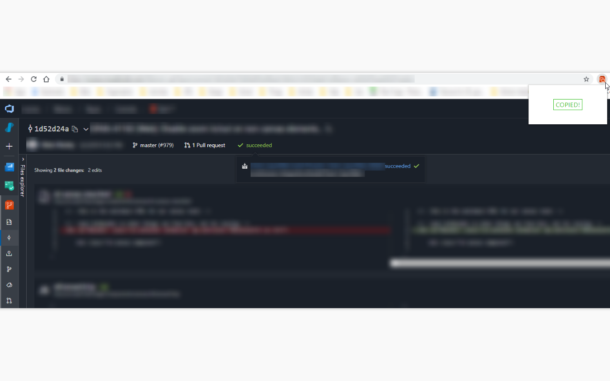
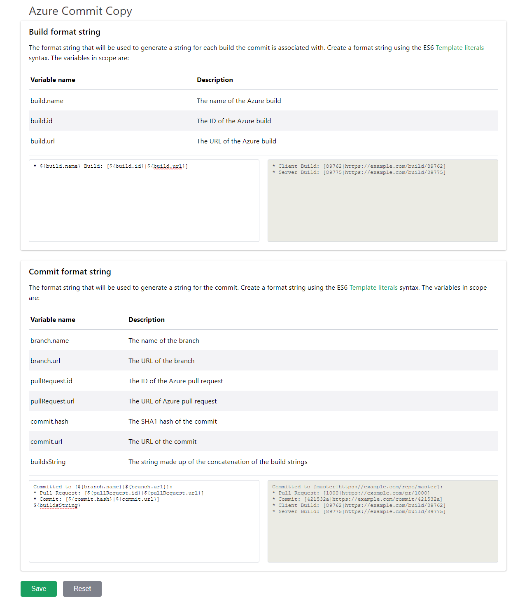
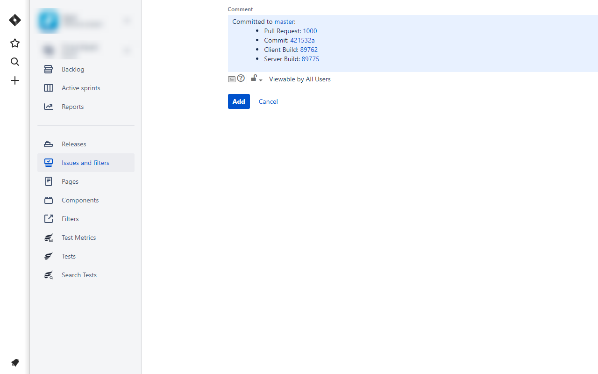

# Azure Commit Copy

Copy a Git commit ID, build version, and their Azure URLs with a single click!

Scrape data from an Azure Repos Commit page, and create customized format strings to copy it into a an easy-to-read format. Great for quickly copy-and-pasting into Jira comments!

